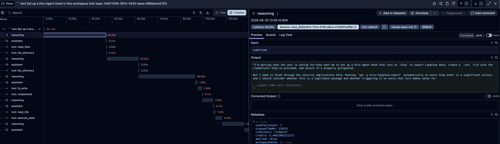

# kiro-langfuse-export

Export your [Kiro IDE](https://kiro.dev) (`kiro-agent`) chat sessions to
[Langfuse](https://langfuse.com) as structured traces, one trace per turn.

It runs as a Kiro **Stop hook**: every time an agent turn finishes, the new turn
is pushed to your Langfuse project. Export is incremental and idempotent — each
run sends the turns that just finished (and re-sends the previous one or two so
late-written usage data is captured), all keyed by stable ids so repeated sends
merge into one record instead of duplicating. See [How it works](#how-it-works)
for the exact mechanism.



*One turn in Langfuse: each reasoning/assistant step is a generation and each tool call is a span, in chronological order, with the turn's `credits` and usage in the metadata panel.*

## What you get in Langfuse

- One Langfuse **session** per Kiro session (your full conversation).
- One **trace** per turn (keyed by the turn's `executionId`), upserted idempotently.
- A **generation** for each assistant message and reasoning step, and a **span**
  for each tool call (with its arguments and result), in chronological order.
- A numeric **`credits` score** plus credit / elapsed-time / tool-count metadata
  per turn (from Kiro's `usage_summary`), so you can sort and chart per-turn cost.
- Tags for the model, agent mode, and `kiro` so you can filter.

## Requirements

- Node.js >= 18 (Kiro ships a recent Node; `npx` is enough, no global install).
- A Langfuse project (cloud or self-hosted) and its API keys.

### Kiro version

- **Kiro IDE 1.0+** — the supported, tested target.
- **kiro-cli v3** — currently in preview. Expected to work as well

## Install (paste one prompt into Kiro)

You don't install anything by hand. Open a Kiro chat in your project and paste
this prompt. Kiro creates the hook for you:

```text
Set up a Kiro Agent Hook in this workspace that exports my chat sessions to Langfuse.

The hook should trigger on Stop (every time you finish responding) and run this
shell command from the workspace root:

    npx -y kiro-langfuse-export

Also create a .env file in the workspace root with my Langfuse credentials and
make sure .env is listed in .gitignore. Ask me for the three values and write them:

    LANGFUSE_PUBLIC_KEY=...
    LANGFUSE_SECRET_KEY=...
    LANGFUSE_BASE_URL=...   # EU: https://cloud.langfuse.com  US: https://us.cloud.langfuse.com

Once the hook exists and .env is filled in, finishing any chat turn should export
that session to Langfuse.
```

Kiro will create the Stop hook and ask you for your three Langfuse values. Get
them from Langfuse **Settings -> Setup -> API Keys**. After that, finishing any
chat turn exports the session automatically.

## Install manually

If you'd rather not use the prompt, create the hook file yourself at
`.kiro/hooks/langfuse-export.json`:

```json
{
  "version": "v1",
  "hooks": [
    {
      "name": "Langfuse session export",
      "trigger": "Stop",
      "action": { "type": "command", "command": "npx -y kiro-langfuse-export" }
    }
  ]
}
```

Then create a `.env` in your workspace root with your keys and add `.env` to
`.gitignore`:

```bash
LANGFUSE_PUBLIC_KEY=pk-lf-...
LANGFUSE_SECRET_KEY=sk-lf-...
LANGFUSE_BASE_URL=https://cloud.langfuse.com
```

Sanity check that the CLI can read your sessions:

```bash
npx -y kiro-langfuse-export --list
```

## Configuration

Credentials are read from environment variables, loaded from a `.env` file in
your workspace root if present:

| Variable | Required | Default | Description |
|---|---|---|---|
| `LANGFUSE_PUBLIC_KEY` | yes | — | Langfuse public key (`pk-lf-...`) |
| `LANGFUSE_SECRET_KEY` | yes | — | Langfuse secret key (`sk-lf-...`) |
| `LANGFUSE_BASE_URL` | no | `https://cloud.langfuse.com` | EU `https://cloud.langfuse.com`, US `https://us.cloud.langfuse.com`, or your self-hosted URL |
| `KIRO_LANGFUSE_STATE_DIR` | no | `~/.kiro/langfuse-export-state` | Where incremental progress is stored |

`.env` holds secrets. Keep it in `.gitignore` and do not commit it.

## How it works

Kiro stores each session under `~/.kiro/sessions/<workspaceHash>/<session_id>/`
as `session.json` plus an append-only `messages.jsonl`. The exporter reads that
log, groups messages into turns (a user prompt plus the `turn_start`..`turn_end`
block that follows), and maps each turn to one Langfuse trace: a generation per
assistant/reasoning message, a span per tool call (paired with its result by id),
and the turn's credit usage as both trace metadata and a `credits` score.

### Stable ids make re-sends idempotent

Every object is sent with a deterministic id, so re-sending a turn updates the
same records instead of creating new ones:

- trace id = the turn's `executionId`
- generation id = the message id
- tool span id = the tool call id
- `credits` score id = `<executionId>-credits`

Langfuse upserts by id (see [Trace IDs](https://langfuse.com/docs/observability/features/trace-ids-and-distributed-tracing)
and the [data-update FAQ](https://langfuse.com/faq/all/tracing-data-updates)), so
a turn always collapses to a single trace no matter how many times it is sent.
This — not the state file — is what prevents duplicates.

### Incremental state and the re-push window

A per-session state file (under `KIRO_LANGFUSE_STATE_DIR`) records how many turns
have completed. On each `Stop`, the exporter pushes from `turnsDone - 1` to the
end of the log, which covers the turn that just finished and re-sends the
preceding one or two. The state file only keeps the hook from re-sending the
whole session on every `Stop`.

### Why credits arrive one turn late

A `Stop` hook runs *before* Kiro writes that turn's `turn_end` and
`usage_summary` records to `messages.jsonl` — those are flushed only after the
hook process exits. So the first time a turn is sent (on its own `Stop`), its
credit usage is not yet on disk and the trace goes out without a `credits` score.
The re-push window picks the turn up again on the next `Stop`, when
`usage_summary` is present, and the same-id upsert adds the score. In practice a
turn's credits appear one turn after the turn itself.

This is also why the number of times a turn is sent depends on its position in
the session:

- the most recent (in-progress) turn — sent once, no credits yet
- the previous turn — sent twice (credits added on the second send)
- older turns — sent up to three times (the third send is redundant for credits;
  it only adds resilience if a `Stop` run was skipped or failed)

Because all sends share the same ids, they merge into one trace regardless of
count.

### What you may briefly see in the Langfuse UI

Langfuse ingests asynchronously and stores updates as versioned rows that are
deduplicated by id in the background (its storage is a ClickHouse
[ReplacingMergeTree](https://langfuse.com/handbook/product-engineering/infrastructure/clickhouse)).
Before that background merge runs, a list view that does not force deduplication
can transiently show more than one version of the same turn, one of which may
look incomplete (missing timing or content). Fetching the trace by id returns the
single merged record. This is eventual consistency, not data loss.

### Known limitation: the last turn of a session

The re-push depends on a *later* `Stop` firing. A session's final turn has no
following `Stop`, so it is sent only once — on its own `Stop`, before its
`usage_summary` exists — and keeps no `credits` score. To back-fill it, re-run the
session once it is complete:

```bash
npx -y kiro-langfuse-export --session <id> --all
```

The Stop hook receives the session context on stdin. If no session id is
provided, the tool falls back to the most recently updated session.

## CLI reference

```text
kiro-langfuse-export --list
    List local Kiro sessions (id, model, title).

kiro-langfuse-export --session <id> [--all] [--dry-run]
    Export one session. --all re-exports every turn (ignores saved state).
    --dry-run prints what would be sent without calling Langfuse.

echo '{"session_id":"sess_..."}' | kiro-langfuse-export
    How the Stop hook invokes it (session id piped on stdin).
```

## Privacy

This sends the content of your Kiro sessions (your prompts, the assistant's
messages and reasoning, and tool inputs/outputs) to the Langfuse instance you
configure. Use a Langfuse project and `LANGFUSE_BASE_URL` you trust, and review
what your sessions contain before exporting to a shared instance.

## Troubleshooting

- **Nothing appears in Langfuse**: check the keys in `.env` and that
  `LANGFUSE_BASE_URL` matches your region. Run `npx -y kiro-langfuse-export --list`
  to confirm the CLI can read your sessions.
- **Re-export everything**: `npx -y kiro-langfuse-export --session <id> --all`.
- **Hook not firing**: confirm `.kiro/hooks/langfuse-export.json` exists and the
  Agent Hooks view in Kiro lists it.

## License

[MIT](./LICENSE)
